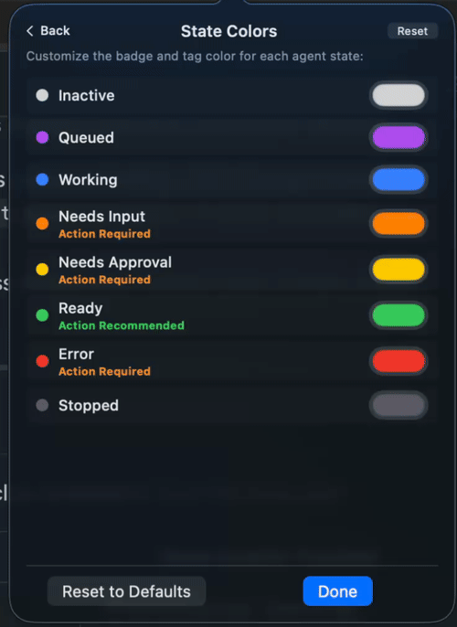
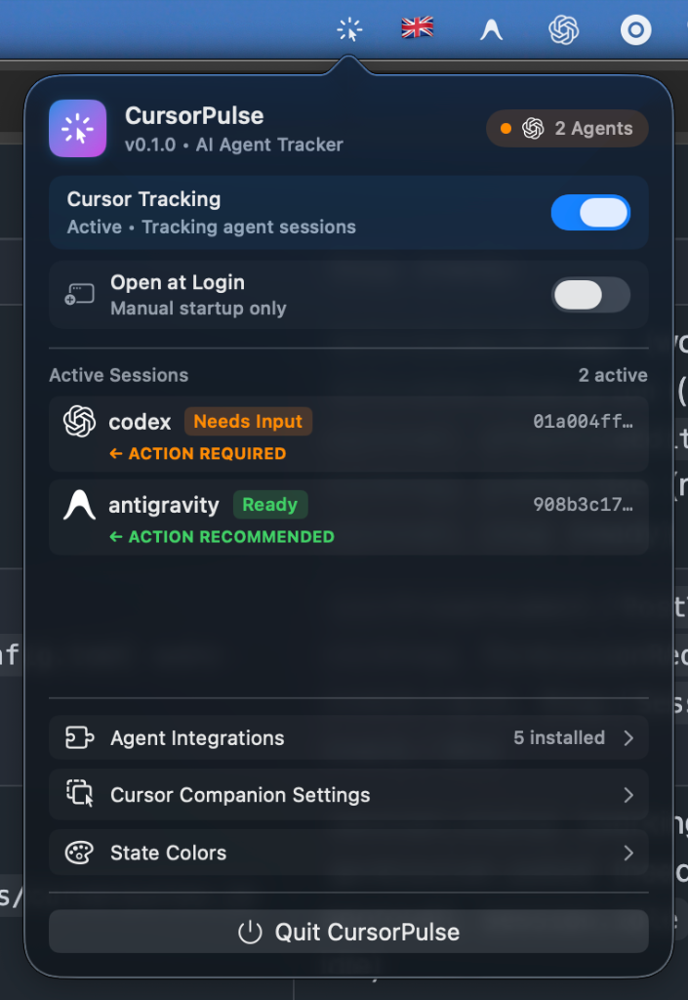
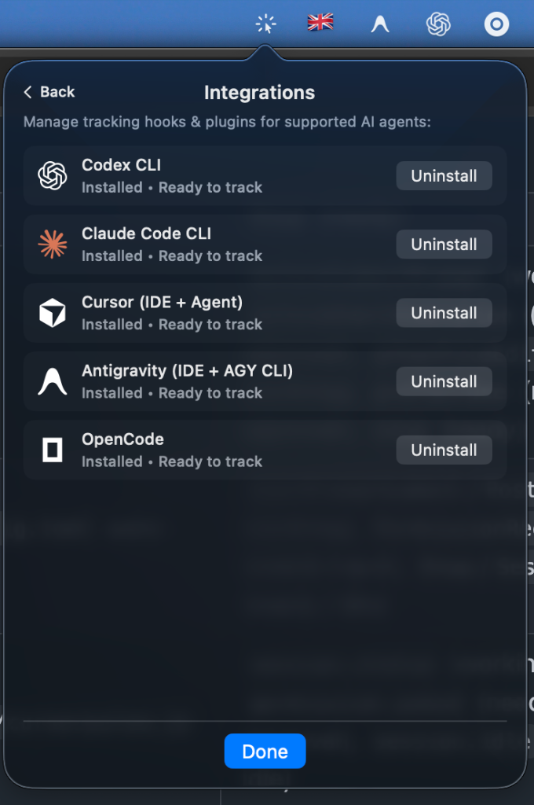
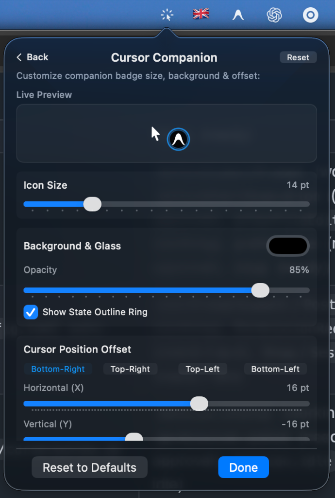
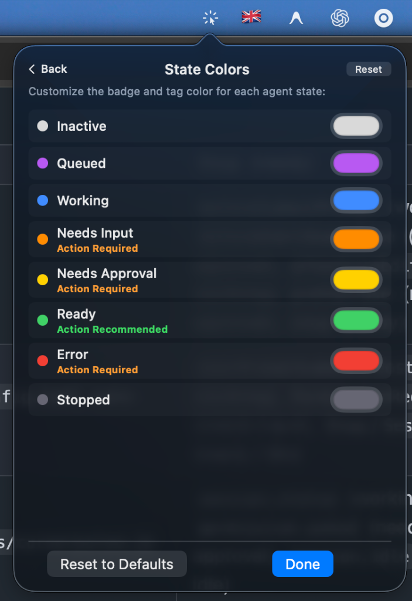

# CursorPulse

<p align="center">
  <strong>Ambient AI Agent Cursor Companion & State Tracker for macOS</strong>
</p>

<p align="center">
  <a href="https://github.com/hieuduy1751/cursor-pulse/releases/latest">
    
  </a>
  
  
  
  
  
</p>

<p align="center">
  <a href="https://github.com/hieuduy1751/cursor-pulse/releases/latest"><strong>Download for macOS (Universal) ↓</strong></a>
</p>

<p align="center">
  
</p>

---

**CursorPulse** is a lightweight macOS menu bar application that displays a live companion badge next to your mouse pointer while AI coding agents are working. It lets you know at a glance whether your agent is actively generating code, awaiting tool approval, waiting for your input, or finished — across multiple tools and concurrent sessions.

- **Zero Accessibility Permissions Required**: The companion badge is a non-activating, click-through overlay window that tracks the pointer using Quartz mouse events (`NSEvent.mouseLocation`). It never intercepts, inspects, or records input.
- **Multi-Agent Awareness**: Seamlessly tracks multiple sessions across Antigravity, Claude Code, Cursor, Codex, and OpenCode, automatically cycling through active agents.

---

## Showcase

| Main Overview & Active Sessions | 1-Click Agent Integrations |
| :---: | :---: |
|  |  |
| **Cursor Companion Customization** | **Universal State Colors** |
|  |  |

---

## Installation

### Via Homebrew *(Recommended)*

```bash
brew install --cask --no-quarantine hieuduy1751/tap/cursor-pulse
```

> **Note**: Because CursorPulse is an open-source, ad-hoc signed app, macOS Gatekeeper may show a verification dialog on first open. You can bypass this by:
> - Running: `xattr -dr com.apple.quarantine /Applications/CursorPulse.app`
> - Or clicking **"Open Anyway"** in **System Settings > Privacy & Security**.

### Manual Download

Download the latest `.dmg` or `.zip` installer from [GitHub Releases](https://github.com/hieuduy1751/cursor-pulse/releases/latest):

- 🍏 **Apple Silicon (M1 / M2 / M3 / M4)**: [`CursorPulse-v0.2.1-mac-arm64.dmg`](https://github.com/hieuduy1751/cursor-pulse/releases/download/v0.2.1/CursorPulse-v0.2.1-mac-arm64.dmg)
- 💻 **Intel (x86_64)**: [`CursorPulse-v0.2.1-mac-x64.dmg`](https://github.com/hieuduy1751/cursor-pulse/releases/download/v0.2.1/CursorPulse-v0.2.1-mac-x64.dmg)
- ⚡️ **Universal (Dual Arch)**: [`CursorPulse-v0.2.1-mac-universal.dmg`](https://github.com/hieuduy1751/cursor-pulse/releases/download/v0.2.1/CursorPulse-v0.2.1-mac-universal.dmg)

---

## Supported AI Agents

CursorPulse integrates via non-invasive Unix hooks and plugins with 1-click installation from the menu bar:

| Agent | Platform | Detection Mechanism | State Events Tracked |
|---|---|---|---|
| **Antigravity** | IDE & AGY CLI | `~/.gemini/config/hooks.json` | `PreInvocation` (working), `PreToolUse` (needs approval / input), `PostToolUse` (working), `Stop` (ready / error) |
| **Claude Code** | CLI | `~/.claude/settings.json` | `UserPromptSubmit` (working), `PreToolUse` (needs approval / input), `PostToolUse` (working), `Stop` (ready), `SessionEnd` (idle) |
| **Cursor** | IDE & Agent | `~/.cursor/hooks.json` | `beforeSubmitPrompt` (working), `beforeShellExecution` (needs approval), `afterFileEdit` (working), `preToolUse` (needs approval), `stop` (ready), `sessionEnd` (idle) |
| **Codex CLI** | CLI | `~/.codex/hooks.json` + `config.toml` auto-trust | `UserPromptSubmit`/`PostToolUse` (working), `PermissionRequest` (needs approval), `Stop` (ready), `SessionEnd` (idle) |
| **OpenCode** | CLI / Agent | `~/.config/opencode/plugins/cursorpulse.js` | `session.status` (working), `permission.asked` (needs approval), `session.error` (error), `session.idle` (ready / idle) |

> **Note (Claude Code)**: Claude Code has no dedicated permission hook, so the `PreToolUse` hook heuristically maps `Bash`, `Edit`, and `Write` tool calls to *Needs Approval*. If you auto-approve those tools in your settings, the badge may briefly show *Needs Approval* while work continues.

> **Note (multi-agent)**: When several agents are active at once, the companion badge cycles through them once per second so each gets visibility. The menu bar popover always shows the full per-session breakdown.

> **Note (errors)**: The Claude Code and Cursor hook APIs expose no failure events, so `Error` states surface only for Antigravity and OpenCode.

---

## Features

### 1. Rotating Loader Ring Animations
Dynamic states feature smooth, high-framerate `AngularGradient` arc spinners that rotate continuously at 60 FPS:
- **Working**: Smooth 0.9s blue spinner loader.
- **Needs Approval / Action Required**: Rapid 0.65s alert spinner with highlighted action tag.
- **Needs Input**: Amber glow halo around the agent brand icon.
- **Queued**: Calm 1.8s purple spinner loader.
- **Ready**: Crisp state ring with soft glow before auto-fading.
- **Error**: Rapid 0.5s red alert spinner.

### 2. Full Cursor Companion Customization
Customize the companion badge directly from the dedicated **Cursor Companion Settings** page:
- **Interactive Live Preview**: Real-time canvas rendering your custom badge alongside a pointer preview.
- **Background & Glass Transparency**: Configurable background color tint with opacity slider from `0% (Fully Transparent Glass)` to `100% (Solid)`.
- **State Outline Ring**: Optional border outline matching current agent state.
- **Icon & Disc Size**: Smooth scaling slider from `10 pt` to `28 pt` (default `16 pt`).
- **Position Offsets & Presets**: Horizontal ($-40\text{ pt}$ to $+50\text{ pt}$) and Vertical ($-50\text{ pt}$ to $+40\text{ pt}$) sliders, with 1-click presets (`Bottom-Right`, `Top-Right`, `Top-Left`, `Bottom-Left`).
- **Reset to Defaults**: Quickly restore standard layout at any time.

### 3. State Colors Customizer
Personalize the color palette for each of the 8 universal agent states using native macOS color pickers.

### 4. Open at Login / Startup
Integrated with Apple's `ServiceManagement` (`SMAppService`) framework. Toggle **Open at Login** with a single switch to have CursorPulse automatically launch when logging into macOS.

### 5. Automatic Hook Sync on Update
On launch with a new app version, CursorPulse automatically refreshes hook scripts, registrations, and Codex trust hashes for every integration you have already installed — no manual reinstalling required. Integrations you explicitly uninstalled are never re-enabled.

---

## Architecture

```
agent-state-cursor/
├── Package.swift
├── Sources/
│   ├── CursorPulse/                   # Main macOS Menu Bar App
│   │   ├── CursorPulseApp.swift       # App lifecycle & status item setup
│   │   ├── Badge/
│   │   │   ├── BadgeView.swift        # SwiftUI 60 FPS spinner & halo rendering
│   │   │   └── BadgeWindow.swift      # Borderless floating NSPanel cursor follower
│   │   ├── Menu/
│   │   │   ├── MenuView.swift         # Pinned header/footer menu & settings pages
│   │   │   └── AgentIconView.swift    # Authentic brand vector icon renderer
│   │   ├── State/
│   │   │   ├── CursorPulseState.swift # Session aggregator & state machine
│   │   │   ├── CursorConfig.swift     # Cursor offset, sizing & background storage
│   │   │   ├── StateColors.swift      # Customizable state color palette
│   │   │   └── LaunchAtLoginManager.swift # SMAppService login item manager
│   │   ├── Installers/                # Hook & plugin installers
│   │   │   ├── AntigravityInstaller.swift
│   │   │   ├── ClaudeInstaller.swift
│   │   │   ├── CursorInstaller.swift
│   │   │   ├── CodexInstaller.swift
│   │   │   ├── CodexConfigToml.swift
│   │   │   ├── OpencodeInstaller.swift
│   │   │   └── Installer.swift
│   │   └── Resources/
│   │       ├── hooks/                 # Bundled shell scripts & JS plugins
│   │       └── icons/                 # Official LobeHub SVG brand icons
│   ├── CursorPulseCore/               # Shared IPC & session models
│   │   ├── Paths.swift                # ~/.cursorpulse directory paths
│   │   ├── SessionRecord.swift        # AgentTool & SessionRecord data models
│   │   └── SessionStore.swift         # FSEvents directory watcher & TTL sweeper
│   └── cursorpulse-report/            # CLI binary for manual & custom reporting
│       └── main.swift
└── scripts/
    └── build-app.sh                   # Release build & .app bundling script
```

### IPC & State Pipeline
1. Hook scripts write lightweight JSON state files to `~/.cursorpulse/sessions/<tool>__<session>.json`.
2. `SessionStore` watches the directory using macOS **FSEvents** for near-instant notification (~0.3s latency).
3. `CursorPulseState` aggregates active records, prioritizing actionable states (`error`, `needsApproval`, `needsInput`) over background states (`working`, `queued`).
4. An automated 15-minute TTL sweep cleans up stale sessions in the event of an unexpected process exit.

---

## Build & Run

### Build Application Bundle

```bash
./scripts/build-app.sh
open .build/CursorPulse.app
```

### CLI Tool Management

You can manage hook installations directly from the command line:

```bash
# Check installation status of all tools
.build/release/CursorPulse --status

# Install or uninstall hooks for a specific tool
.build/release/CursorPulse --install antigravity    # antigravity | claude | cursor | codex | opencode
.build/release/CursorPulse --uninstall claude
```

### Manual Session Reporting (Custom Scripts)

Use the bundled `cursorpulse-report` utility to emit states from custom workflows or scripts:

```bash
# Report working state for a custom task
echo '{"tool":"antigravity","session_id":"task-123"}' | .build/release/cursorpulse-report working

# Report approval required
echo '{"tool":"claude","session_id":"task-123"}' | .build/release/cursorpulse-report needs_approval

# Clear session
echo '{"tool":"antigravity","session_id":"task-123"}' | .build/release/cursorpulse-report idle
```

---

## Requirements

- **macOS**: 14.0 (Sonoma) or newer
- **Swift**: 5.9+ / Xcode 15+
